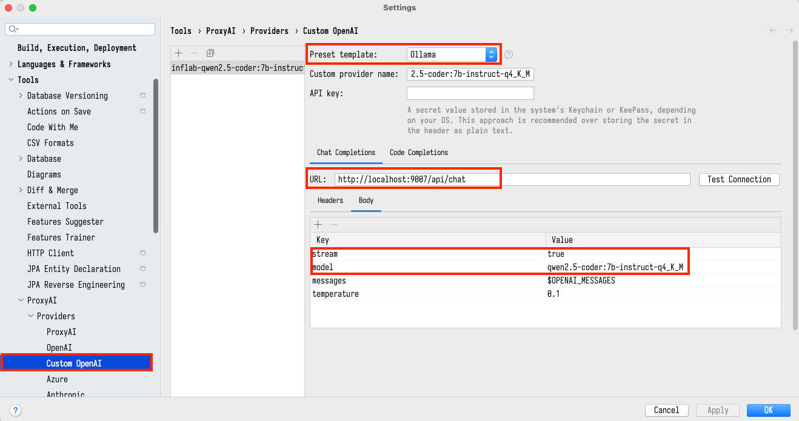
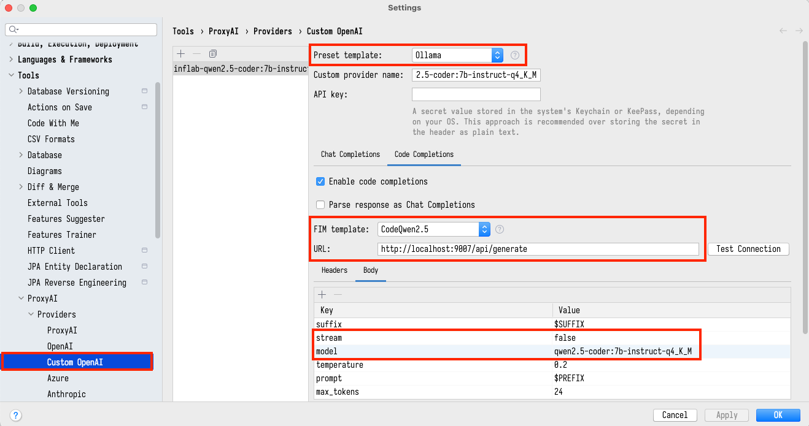

# Ollama RAG API 프로젝트

이 프로젝트는 [Ollama](https://github.com/ollama/ollama)를 사용하여 로컬에서 LLM(Large Language Model)을 실행하고, ChromaDB를 벡터 데이터베이스로 활용한 RAG(Retrieval-Augmented Generation) API 서버입니다. NestJS 프레임워크로 개발되었습니다.

## 🚀 시작하기

### 사전 요구사항

- [Node.js](https://nodejs.org/) (v16 이상)
- [pnpm](https://pnpm.io/installation)
- [Docker](https://www.docker.com/get-started)
- [Docker Compose](https://docs.docker.com/compose/install/)
- [Ollama](https://github.com/ollama/ollama#installation) (로컬 설치)

## 📋 설치 및 실행 가이드

### 1. Ollama 설정하기

1. Ollama를 아직 설치하지 않았다면, [Ollama 공식 문서](https://github.com/ollama/ollama#installation)를 참고하여 설치합니다.

2. 원하는 LLM 모델을 다운로드합니다. 이 프로젝트에서는 예시로 `qwen2.5-coder:7b-instruct-q4_K_M` 모델을 사용합니다:

```bash
ollama pull qwen2.5-coder:7b-instruct-q4_K_M
```

3. Ollama 서버가 실행 중인지 확인합니다:

```bash
ollama serve
```

### 2. 프로젝트 설정하기

1. 저장소를 클론하고 프로젝트 디렉토리로 이동합니다:

```bash
git clone <repository-url>
cd <project-directory>
```

2. 프로젝트 의존성을 설치합니다:

```bash
pnpm install
```

3. `.env` 파일을 확인하거나 필요에 따라 설정합니다:

```
PORT=9007
CHROMA_HOST=chromadb
CHROMA_URL=http://chromadb:8000
```

### 3. ChromaDB에 데이터 시드하기

1. 시드 스크립트를 빌드합니다:

```bash
pnpm build:seed
```

2. ChromaDB에 데이터를 시드합니다:

```bash
pnpm seed
```

> 기본적으로 `package.json`에 정의된 대로 다음 경로의 코드를 벡터화합니다:  
> 다른 경로를 사용하려면 `package.json`의 `seed` 스크립트에서 `DIRECTORY_PATHS` 환경 변수를 수정하세요.
> 


### 4. 애플리케이션 실행하기

1. Docker Compose를 사용하여 ChromaDB와 NestJS API 서버를 실행합니다:

```bash
docker-compose up -d
```

2. 서비스가 정상적으로 실행되었는지 확인합니다:

```bash
docker-compose ps
```

3. 로그를 확인하여 오류가 없는지 확인합니다:

```bash
docker-compose logs -f
```

## 📚 API 사용법

API 서버는 기본적으로 `http://localhost:9007`에서 실행됩니다.

### 주요 엔드포인트

- `POST /api/chat`: 관련 코드 컨텍스트와 함께 LLM에 채팅 요청을 보냅니다.
- `POST /api/generate`: 관련 코드 컨텍스트로 강화된 프롬프트로 LLM에 텍스트 생성 요청을 보냅니다.
- `POST /api/embeddings`: 텍스트에 대한 임베딩을 생성합니다.

## 🔧 문제 해결

- **ChromaDB 연결 오류**: ChromaDB 컨테이너가 실행 중이고 `CHROMA_URL`이 올바르게 설정되어 있는지 확인합니다.
- **Ollama 연결 오류**: Ollama 서버가 실행 중이고 올바른 모델이 설치되어 있는지 확인합니다.
- **시드 오류**: 시드 명령에 지정된 디렉토리 경로가 유효한지 확인합니다.

## 🏗️ 프로젝트 구조

- `src/`: 소스 코드 디렉토리
  - `ollama/`: Ollama API 관련 코드
  - `chroma/`: ChromaDB 벡터 데이터베이스 연동 코드
  - `.script/`: 시드 스크립트를 포함한 유틸리티 스크립트
- `docker-compose.yaml`: 서비스 구성
- `Dockerfile`: NestJS API 서버 Docker 이미지 구성

## 📝 참고 사항

- 이 프로젝트는 로컬 개발 환경에서 RAG 시스템을 구현하는 예시입니다.
- 프로덕션 환경에서 사용하기 전에 보안 및 성능 최적화를 고려하세요.

## (Jetbrain) ProxyAI 플러그인과 함께 사용하기

Jetbrain IDE 를 사용하실 경우, ProxyAI 플러그인을 통해 LLM 모델을 사용할 수 있습니다. 아래와 같이 설정합니다.



